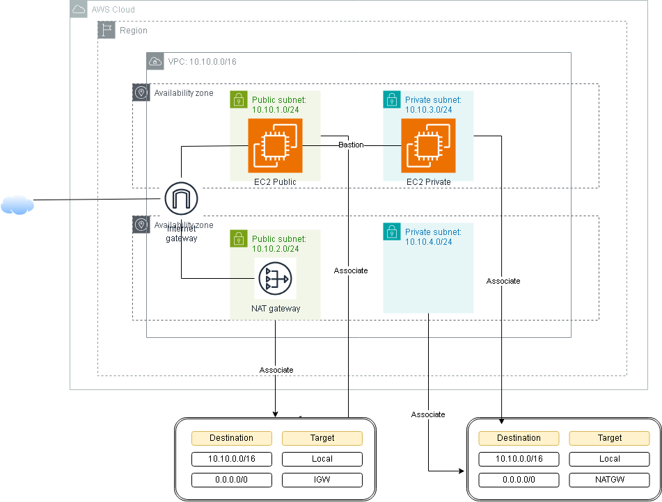

## Security Group

### Một số đặc điểm cơ bản của Security Group:

- Chỉ có thể thêm vào các Allow rule, mà không thể bổ sung Deny rule.
- Có thể chỉ định các rule riêng biệt cho lưu lượng truy cập đi ra hoặc đi vào.
- Một Security Group mới được tạo ra không có sẵn Inbound rules. Do đó, tại thời điểm ban đầu, Instance sẽ không cho phép bất cứ lưu lượng truy cập nào đi vào, yêu cầu ta phải bổ sung Inbound rule để cấp phép truy cập.
- Mặc định, Security Group có sẵn Outbound rule cho phép mọi lưu lượng được phép đi ra khỏi Instance. Rule này có thể được chỉnh sửa (xóa) và bổ sung các Outbound rule cụ thể, chỉ rõ lưu lượng nào xuất phát từ Instance được phép đi ra ngoài. Nếu Security Group không có Outbound rule thì không một lưu lượng nào được phép đi ra khỏi Instance.
- Security Groups là một dịch vụ Stateful - nghĩa là nếu lưu lượng đi vào Instance đã được cấp phép thì lưu lượng cũng có thể đi ra ngoài Instance, và ngược lại, bất kể Outbound rule như thế nào.
- Các Instance chỉ có thể giao tiếp được với nhau khi và chỉ khi chúng được liên kết với Security Group cho phép kết nối, hoặc Security Group mà Instance có liên kết chứa Rule cho phép lưu lượng truy cập (ngoại trừ Security Group mặc định với các rule mặc định cho phép toàn bộ lưu lượng được truy cập).
- Security Group được liên kết với các network interface. Sau khi Instance đã được khởi tạo, ta vẫn có thể thay đổi Security Group đã được gán với Instance, điều này cũng thay đổi Security Group đang được gán với primary network interface tương ứng.

## Security Group Rule

Rule được sinh ra để cấp quyền truy cập cho lưu lượng đi vào hoặc đi ra khỏi Instance. Quyền truy cập này có thể được áp dụng cho một CIDR cụ thể hoặc cho một Security Group nằm trong cùng một VPC hoặc nằm trong một VPC khác nhưng có kết nối peering đã được khởi tạo.

### Các thành phần cơ bản của Security Group Rule:

- **(Chỉ đối với Inbound rules):** Gồm điểm xuất phát (nguồn) của lưu lượng truy cập và port đích hoặc dải port. Nguồn có thể là một Security Group khác, là một dải IPv4 hoặc IPv6 CIDR hoặc đơn thuần là một địa chỉ IPv4 hoặc IPv6.
- **(Chỉ đối với Outbound rules):** Gồm đích đến của lưu lượng và port đích hay dải port đích. Đích đến có thể là một Security Group khác, là một dải IPv4 hoặc IPv6 CIDR hoặc đơn thuần là một địa chỉ IPv4 hoặc IPv6, hoặc là một dịch vụ bắt đầu bằng một tiền tố (ví dụ: `igw_xxx`) nằm trong danh sách prefix ID (một dịch vụ được xác định bởi prefix ID - tên và ID của dịch vụ khả dụng trong region).
- Mọi giao thức đều có một số giao thức chuẩn. Ví dụ: SSH là 22.

## Network ACLs

VPC sau khi khởi tạo sẽ có sẵn một Network ACL mặc định và có thể được sửa đổi. Mặc định, nó cấp phép truy cập cho tất cả lưu lượng truy cập IPv4 hoặc IPv6 có thể đi ra hoặc đi vào VPC.

- Có thể tạo một Network ACL tùy chỉnh và liên kết nó với một subnet. Mặc định các Network ACL tùy chỉnh từ chối tất cả lưu lượng truy cập đi vào và đi ra, cho đến khi ta bổ sung rule cấp phép truy cập.
- Từng subnet trong VPC phải được liên kết với một Network ACL. Nếu subnet không được liên kết với một Network ACL cụ thể thì subnet sẽ được tự động liên kết với Network ACL mặc định.
- Một Network ACL có thể liên kết với nhiều subnet. Tuy nhiên, một subnet chỉ có thể liên kết với một Network ACL tại một thời điểm. Khi liên kết Network ACL mới với subnet, thì liên kết trước đó sẽ bị xóa.
- Một Network ACL chứa một danh sách các rule được đánh số khác nhau. AWS đánh giá các rule dựa trên số thứ tự được gán, bắt đầu với rule được đánh số thấp nhất, để xác định xem lưu lượng có được phép đi vào hay đi ra khỏi bất kỳ subnet nào được liên kết với Network ACL hay không. Số thứ tự lớn nhất có thể được gán cho rule là 32766 (tương đương số lượng rule lớn nhất của một Network ACL là 32766).
- Network ACL có các rule cấp phép đi vào hoặc đi ra tách biệt và rule có thể là cho phép hoặc từ chối lưu lượng.
- Network ACL là dịch vụ Stateless, nghĩa là phản hồi đối với lưu lượng truy cập được phép đi vào, phải tuân theo rule đối với lưu lượng truy cập đi ra (và ngược lại).

## Network ACL Rules

Có thể thêm hoặc xóa một rule khỏi Network ACL mặc định hoặc tạo Network ACL mới cho VPC. Khi thêm hoặc xóa một rule khỏi Network ACL, các thay đổi sẽ tự động được áp dụng cho các subnet được liên kết với nó.

### Các thành phần của một Network ACL Rule:

- **Rule number:** Rule bắt đầu được đánh giá với rule có số thứ tự thấp nhất. Ngay khi rule đó match với lưu lượng truy cập, nó sẽ ngay lập tức được áp dụng cho dù nó mâu thuẫn với một rule nào đó được đánh số lớn hơn trong danh sách.
- **Type:** Loại lưu lượng, ví dụ SSH. Có thể chỉ định tất cả các loại lưu lượng truy cập hoặc phạm vi tùy chỉnh.
- **Protocol:** Chỉ định giao thức cùng số giao thức chuẩn.
- **Port range:** Port hoặc dải port lắng nghe của lưu lượng truy cập. Ví dụ: HTTP là 80.
- **Source:** [Chỉ đối với Inbound rule] Xuất phát của lưu lượng truy cập (giá trị là dải CIDR).
- **Destination:** [Chỉ đối với Outbound rule] Điểm đến của lưu lượng truy cập (giá trị là dải CIDR).
- **Allow/Deny:** Chỉ rõ là Cho phép hoặc Từ chối lưu lượng truy cập.

### VPC Demo
